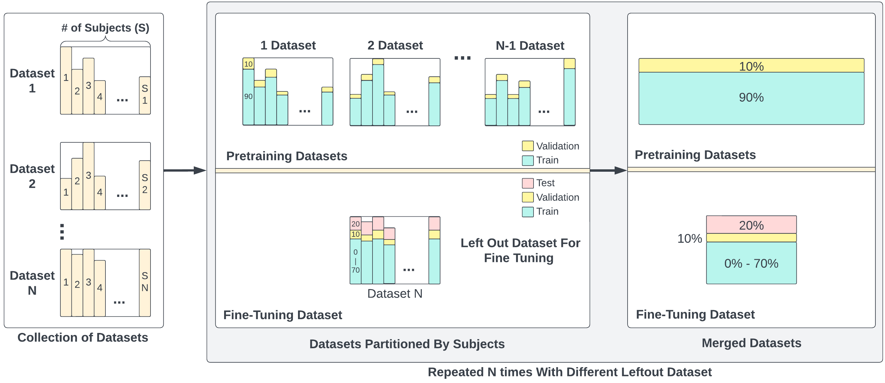

# Leave-One-Dataset-Out (LODO)
Tensorflow implementation of **Supervied Pre-training with LODO**:

This work has been published in SmartComp2023.

**Combining Public Human Activity Recognition Datasets to Mitigate Labeled Data Scarcity** [[Paper](https://arxiv.org/abs/2306.13735)]

*[Riccardo Presotto](https://sites.google.com/view/riccardopresotto/home), [Sannara Ek](https://scholar.google.com/citations?user=P1F8sQgAAAAJ&hl=en&oi=ao), [Gabriele Civitarese](https://civitarese.di.unimi.it/),[François Portet](https://lig-membres.imag.fr/portet/home.php), [Philippe Lalanda](https://lig-membres.imag.fr/lalanda/), [Claudio Bettini](https://sites.google.com/view/claudio-bettini)*


<p align="center">
  
</p>

If our project is helpful for your research, please consider citing : 
``` 
@misc{presotto2023combining,
      title={Combining Public Human Activity Recognition Datasets to Mitigate Labeled Data Scarcity}, 
      author={Riccardo Presotto and Sannara Ek and Gabriele Civitarese and François Portet and Philippe Lalanda and Claudio Bettini},
      year={2023},
      eprint={2306.13735},
      archivePrefix={arXiv},
      primaryClass={cs.CV}
}
```


## Table of Content
* [1. Updates](#1-Updates)
* [2. Installation](#2-installation)
  * [2.1 Dependencies](#21-dependencies)
  * [2.2 Data](#22-data)
* [3. Quick Start](#3-quick-start)
  * [3.1 Using the LODO partition](#31-Using-the-LODO-partition)
  * [3.2 Running Our Supervised Pretraining Pipeline](#32-Running-Our-Supervised-Pretraining-Pipeline)
  * [3.3 Loading and Using our Pre-Trained Models](#33-Loading-and-Using-our-Pre-Trained-Models)
* [4. Acknowledgement](#4-acknowledgement)

### 3.3 Loading and Using our Pre-Trained Models
## 1. Updates


***11/07/2023***
Initial commit: Code of LODO is released.

## 2. Installation
### 2.1 Dependencies

This code was implemented with Python 3.7, Tensorflow 2.10.1 and CUDA 11.2. Please refer to [the official installation](https://www.tensorflow.org/install). If CUDA 11.2 has been properly installed : 
```
pip install tensorflow==2.10.0
```

Another core library of our work is Hickle for the data storage management. Please launch the following command to be able to run our data partitioning scripts: 
```
pip install hickle==5.0.2
```

To run our training and evaluatioin pipeline, additional dependecies are needed. Please launch the following command:

```
pip install -r requirements.txt
```

Our baseline experiments were conducted on a Debian GNU/Linux 10 (buster) machine with the following specs:

CPU : Intel(R) Xeon(R) CPU E5-2623 v4 @ 2.60GHz

GPU : Nvidia GeForce Titan Xp 12GB VRAM

Memory: 80GB 


### 2.2 Data

We provide scripts to automate downloading (With the exception of the MobiAct dataset which requires manual request from  the authors) and proprocessing the datasets used for this study.
See scripts in dataset folders. e.g, for the UCI dataset, run DATA_UCI.py

For running the 'Combined' dataset training and evaluation pipeline, all datasets must first be downloaded and processed.
Please run all scripts in the 'datasets' folder.

Tip: Manually downloading the datasets and placing them in the 'datasets/dataset' folder may be a good alternative for stabiltiy if the download pipeline keeps failing VIA the provided scripts.

UCI
```
https://archive.ics.uci.edu/ml/datasets/human+activity+recognition+using+smartphones
```

MotionSense
```
https://github.com/mmalekzadeh/motion-sense/tree/master/data
```

HHAR
```
http://archive.ics.uci.edu/ml/datasets/Heterogeneity+Activity+Recognition
```

RealWorld
```
https://www.uni-mannheim.de/dws/research/projects/activity-recognition/#dataset_dailylog
```

PAMAP2
```
https://archive.ics.uci.edu/dataset/231/pamap2+physical+activity+monitoring
```

MobiAct

The Mobiact Dataset is only available upon request from the authors. Please contact and request them at:
```
https://bmi.hmu.gr/the-mobifall-and-mobiact-datasets-2/
```

## 3. Quick Start

We provide both a jupyter notebook (.ipynb) and a python script (.py) versions for all the codes.

### 3.1 Using the LODO partition

After downloading and running all the DATA processing scripts in the dataset folder, launch the LODO.ipynb jupyter notebook OR LODO.py script to partition the datasets as used in our study.  


### 3.2 Running Our Supervised Pretraining Pipeline

After running the provided LODO scripts, launch the Supervised_Pretraining.ipynb jupyter notebook OR Supervised_Pretraining.py script to launch our pre-training pipeline. 

An example to launch the script is below:

```
python3.7 Supervised_Pretraining.py --architecture hart --testingDataset MotionSense --SSL_epochs 200 --SSL_batch_size 64 --finetune_epoch 50 --finetune_batch_size 128
```

To select different architectures for the pre-training, change the value of the 'architecture' flag to one of the following:

```
HHAR,MobiAct,MotionSense,RealWorld_Waist,UCI,PAMAP
```

### 3.3 Loading and Using our Pre-Trained Models

Due to file storage limit constraints, the pretrain-ed models are available at the follow link:

```

https://drive.google.com/file/d/1W7eE-DV_tLraSdTIiGVet38EPi2_C-lc/view?usp=drive_link
```


## 4. Acknowledgement

This work has been partially funded by Naval Group, by MIAI@Grenoble Alpes (ANR-19-P3IA-0003), and granted access to the HPC resources of IDRIS under the allocation 2023-AD011013233R1 made by GENCI.

Part of this research was also supported by projects SERICS (PE00000014) and by project MUSA – Multilayered Urban Sustainability Action,  funded by the European Union – NextGenerationEU, under the National Recovery and Resilience Plan (NRRP) Mission 4 Component 2 Investment Line 1.5: Strengthening of research structures and creation of R\&D “innovation ecosystems”, set up of “territorial leaders in R\&D”.

